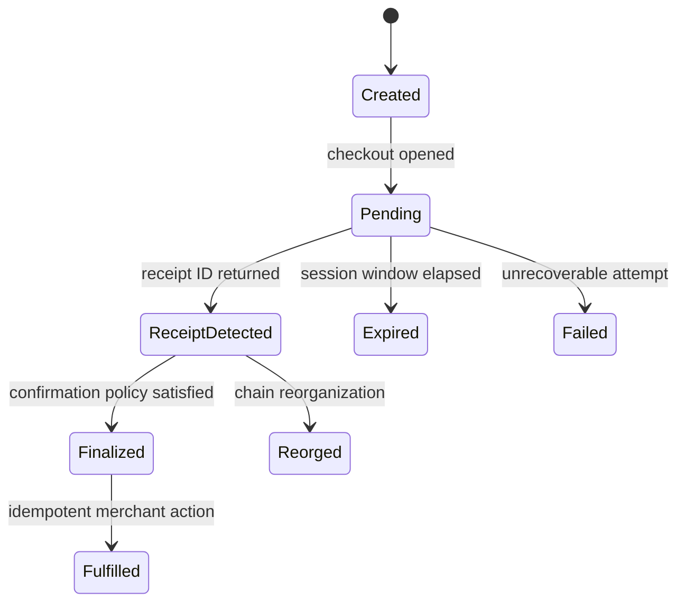

A checkout session is temporary coordination state. A merchant order is a durable business record.
Keep those responsibilities separate from the first line of code.

## Merchant data model

At minimum, persist:

| Field | Why it matters |
| --- | --- |
| Merchant order ID | Stable idempotency and support reference |
| Expected amount, asset, and network | Prevent browser-side order manipulation |
| Expected recipient | Ensure funds are routed to the configured merchant wallet |
| UniFi session ID | Correlate the hosted checkout and status request |
| Session creation and expiry time | Handle abandoned or expired attempts |
| UniFi receipt ID | Durable link to the detected payment |
| Fulfilment status | Make fulfilment idempotent and auditable |
| Finality status or confirmation count | Apply the risk policy for the selected network |

Create a new payment attempt without mutating a completed attempt. Enforce one-way fulfilment state
transitions so repeated status checks cannot ship or credit the same order twice.

## Status returned by the widget

The TypeScript client normalizes a status check into:

| State | Meaning | Merchant action |
| --- | --- | --- |
| `pending` | No receipt ID is available for the session yet | Keep the order unpaid and let the customer check again |
| `paid` | UniFi returned a receipt ID | Store the receipt, verify the order details, and apply your finality policy |
| `failed` | The request, proxy, upstream API, or response failed | Show a recoverable message and preserve the order for retry |

<Warning>
  In the widget API, `paid` means that a receipt ID is available. It does not by itself prove the
  number of blockchain confirmations required for irreversible fulfilment.
</Warning>

The session result uses the historical name `paid`, but merchants should present it as **Payment
submitted** or **Order confirmation in progress** until the receipt itself reaches `Finalized`.

## Temporary session lookup

UniFi retains the `session_id → receipt_id` mapping in Redis for two hours. This window is designed
for checkout polling and return-to-merchant status checks.

Before that lookup expires:

1. record the session ID against the order;
2. store the returned receipt ID durably;
3. verify the receipt belongs to the expected order details; and
4. move fulfilment through your own idempotent state machine.

Do not use the temporary lookup as customer order history, accounting storage, or the only way to
recover a receipt.

## Session polling policy

Before a receipt ID exists, the widget checks the temporary session lookup. This step is manual by
default: the waiting sheet retains the **Check payment status** button and makes no background
status requests.

Set `statusPollIntervalMs` to a positive number to opt into automatic checks. The automatic variant
shows a draining progress ring and countdown, reports when the last check ran, and keeps a compact
refresh control available for an immediate check. The controller avoids starting a second request
while a check is already in flight.

An application-level setting such as `PAYMENT_STATUS_POLL_INTERVAL` can expose this cadence as
public configuration in seconds. Treat an unset or empty value as manual mode, accept only positive
whole seconds, and convert the value to milliseconds before passing it to the widget.

This session cadence only detects when a receipt becomes available. It is separate from receipt
finality checks after detection.

## Receipt detection and finality

These are separate milestones:

The appropriate confirmation policy depends on the selected network and the risk of the goods or
service. Digital access, high-value physical goods, withdrawals, and irreversible account credits
may require different policies.

## Receipt refresh policy

After the session lookup returns a receipt ID:

1. fetch `/payment/onchain/receipt/:receiptId` immediately;
2. show `Processing` as payment submitted and `Confirmed` as confirmed on-chain but still waiting
   for finality;
3. while either state remains active, refresh automatically every 15 minutes to conserve API
   credits;
4. provide a clearly labeled refresh icon or button for an immediate customer-requested check; and
5. stop automatic checks for `Finalized`, `Failed`, or `Reorged`.

Only `Finalized` should change the merchant UI to **Order confirmed**. If a refresh request fails,
preserve the last known state and keep fulfilment blocked rather than treating the transport error
as a failed or finalized payment.

## Failure handling

- **Customer closed the UniFi tab:** keep the merchant order pending and retain the pay link until
  the UI expiry.
- **Status remains pending:** wait for the next configured check or allow an immediate manual check
  without creating a second order.
- **Session expired:** create a new payment attempt with a new session ID; preserve the old attempt
  for auditability.
- **API key rejected:** disable fulfilment, alert the operator, and correct the server secret.
- **UniFi API unavailable:** return a recoverable message and retry with bounded backoff from the
  merchant workflow.
- **Receipt reorged or failed:** keep fulfilment blocked or begin the merchant's recovery process.

## Production checklist

### Security

- [ ] The API key exists only in the server secret store.
- [ ] The browser calls a same-origin or explicitly allowlisted proxy.
- [ ] Amount, asset, network, and recipient originate from a trusted order record.
- [ ] The proxy exposes only the required status route.
- [ ] No signing material or API key appears in logs.

### Checkout behavior

- [ ] Successful Sepolia payment and receipt link.
- [ ] Pending payment with the default manual-only status action.
- [ ] Configured automatic session checks, draining progress ring, countdown, last-check time, and immediate refresh.
- [ ] Receipt `Processing` and `Confirmed` states, 15-minute automatic refresh, and immediate manual refresh.
- [ ] `Finalized` is the only state that confirms the order; `Failed` and `Reorged` remain unfulfilled.
- [ ] Expired session and a new payment attempt.
- [ ] Invalid or rejected API key.
- [ ] Upstream timeout or outage.
- [ ] Narrow mobile viewport, keyboard navigation, Escape-to-close, and return from the UniFi tab.

### Operations

- [ ] Order, session ID, and receipt ID are stored durably.
- [ ] Fulfilment is idempotent.
- [ ] Monitoring distinguishes merchant errors, proxy errors, and upstream errors.
- [ ] Rate limits match expected checkout traffic.
- [ ] The tested widget commit is pinned in the lockfile and deployed with `npm ci`.
- [ ] The network-specific confirmation policy is documented and enforced.

<Card title="Review the server boundary" icon="shield-halved" href="/payment-gateway/server-proxy">
  Confirm secret handling, route allowlisting, CORS, and response behavior before production.
</Card>
