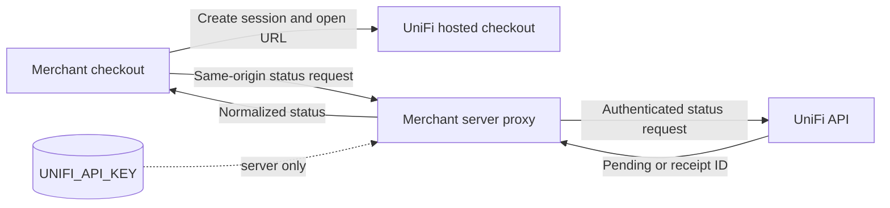

The UniFi payment gateway adds a stablecoin payment method to the checkout you already own. Your
application supplies the amount, receiving wallet, asset, and network; UniFi opens the hosted
payment flow and returns a receipt that your server can reconcile with the order.

<Frame caption="UniFi embedded beside the payment methods and order summary in FliQ Market.">
  
</Frame>

<CardGroup cols={2}>
  <Card title="Quickstart" icon="bolt" href="/payment-gateway/quickstart">
    Install the package, add the server proxy, and open your first payment.
  </Card>
  <Card title="React components" icon="react" href="/payment-gateway/react">
    Use a complete widget or compose UniFi into an existing payment-method UI.
  </Card>
  <Card title="Headless TypeScript" icon="code" href="/payment-gateway/headless">
    Build sessions, hosted checkout links, status checks, and receipt links without React.
  </Card>
  <Card title="FliQ Market example" icon="cart-shopping" href="/payment-gateway/fliq-market">
    Follow a working merchant integration from product selection to payment reconciliation.
  </Card>
</CardGroup>

## Choose an integration path

| Path | Best for | Package entry point |
| --- | --- | --- |
| Complete React widget | A new checkout or the shortest path to a working UI | `unifi-pay-widget/react` |
| Composable React components | An existing checkout that owns its Pay button and success state | `unifi-pay-widget/react` |
| Headless TypeScript | A custom framework, mobile web shell, or backend-driven UI | `unifi-pay-widget` |
| Server proxy | Every browser integration that checks payment status | `unifi-pay-widget/server` |

The core package and React components never read the API key. The server entry point is the only
layer allowed to access `UNIFI_API_KEY`.

## How the pieces fit

<Note>
  `MERCHANT_WALLET_ADDRESS` is public merchant configuration passed to the widget as `recipient`.
  `UNIFI_API_KEY` is a secret and must stay behind the server proxy.
</Note>

## Checkout lifecycle

<Steps>
  <Step title="Create the merchant order">
    Store your order ID and the expected amount, asset, network, recipient, and expiry in your own
    database. Do not trust pricing supplied only by the browser.
  </Step>
  <Step title="Create a UniFi payment session">
    `createUniFiPayment` generates a random 64-character hexadecimal session ID and the hosted
    checkout URL. Record that session ID against the order.
  </Step>
  <Step title="Send the payer to UniFi">
    Open the hosted checkout with the exact order details. The payer connects a wallet, completes
    Permit2 approval if required, and signs the short-lived payment authorization.
  </Step>
  <Step title="Check through your proxy">
    The merchant browser requests `/api/unifi/payment/merchant/session/:sessionId`. The same-origin
    server proxy validates the route and adds the API key server-side.
  </Step>
  <Step title="Persist the receipt and fulfil">
    Store the confirmed receipt ID with the order. Apply the finality policy appropriate for the
    selected network before irreversible fulfilment.
  </Step>
</Steps>

## Supported payment pairs

- Assets: **USDT**, **USDC**, and **DAI**
- Networks: **Ethereum**, **Polygon**, and **Sepolia**

The package does not silently replace an invalid selection. The hosted checkout remains the final
authority on whether a pair is currently available.

<Warning>
  UniFi's `session_id → receipt_id` lookup is temporary and retained for two hours. It supports
  checkout status checks; it is not a durable merchant order database.
</Warning>

<CardGroup cols={2}>
  <Card title="Secure the server boundary" icon="shield-halved" href="/payment-gateway/server-proxy">
    Configure secrets, proxy routing, same-origin requests, and explicit CORS exceptions.
  </Card>
  <Card title="Operate the lifecycle" icon="rotate" href="/payment-gateway/lifecycle">
    Handle pending, paid, failed, expiry, receipts, persistence, and chain finality.
  </Card>
</CardGroup>
