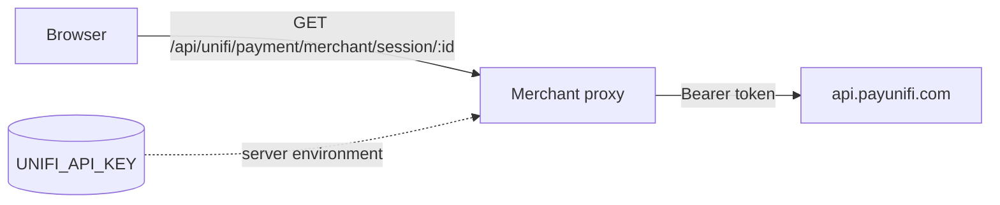

The payment widget checks status through a same-origin merchant route. The server proxy validates
the request, adds `UNIFI_API_KEY`, calls the UniFi API, and returns the upstream status response.



The proxy is intentionally narrow. It accepts only `GET` and `OPTIONS`, and only the payment-status
path containing a valid 64-character hexadecimal session ID. It is not an arbitrary API passthrough.

## Cloudflare Pages

Create `functions/api/unifi/[[path]].ts`:

```ts
import { createCloudflarePagesFunction } from "unifi-pay-widget/server";

type Env = {
  UNIFI_API_KEY: string;
  UNIFI_API_BASE_URL?: string;
};

export const onRequest = createCloudflarePagesFunction<Env>();
```

Add `UNIFI_API_KEY` as an encrypted Cloudflare Pages secret. Do not add it as a public build-time
variable.

## Any Fetch API-compatible server

```ts
import { handleUniFiProxyRequest } from "unifi-pay-widget/server";

export function GET(request: Request) {
  return handleUniFiProxyRequest(
    request,
    { UNIFI_API_KEY: process.env.UNIFI_API_KEY },
    { apiPrefix: "/api/unifi" },
  );
}
```

Pass the original request so the proxy can validate its URL, method, and origin.

## Configuration

| Option | Default | When to set it |
| --- | --- | --- |
| `apiPrefix` | `/api/unifi` | Your server deliberately mounts the proxy at a different path |
| `allowedOrigins` | Same-origin only | A separate frontend origin must call the proxy |
| `fetch` | Runtime Fetch | Tests or a compatible runtime need an injected implementation |
| `UNIFI_API_BASE_URL` | `https://api.payunifi.com` | UniFi admin, local, staging, or self-hosted infrastructure |

Most production merchants should use the defaults for `apiPrefix` and `UNIFI_API_BASE_URL`.

## Cross-origin frontend

Same-origin requests need no extra CORS configuration. If the frontend and proxy deliberately use
different origins, allow each literal browser origin:

```ts
export const onRequest = createCloudflarePagesFunction<Env>({
  allowedOrigins: [
    "https://shop.example.com",
    "https://admin.example.com",
  ],
});
```

Do not use bind addresses such as `0.0.0.0` as browser origins, and do not use a wildcard for a
secret-bearing proxy.

## Response behavior

- Valid status responses pass through with `Cache-Control: no-store`.
- The proxy removes `Set-Cookie` from the upstream response.
- Missing server configuration returns `500` without revealing a key.
- Disallowed routes return `404`; unsupported methods return `405`.
- An unreachable UniFi API returns `502`.
- CORS headers are emitted only for the request origin or an explicitly allowed origin.

## Security checklist

- Keep `UNIFI_API_KEY` in the runtime's encrypted secret store.
- Search generated JavaScript, HTML, source maps, logs, and browser requests for accidental key
  exposure before launch.
- Keep the allowlist limited to the payment-status route.
- Add merchant-side monitoring and rate limits appropriate for checkout traffic.
- Reject status checks that are not associated with a known merchant order when your server owns
  that association.
- Log order IDs and session IDs as operational identifiers, but never log API keys or wallet signing
  material.

<Warning>
  The proxy confirms that UniFi has a receipt for the session. Your order system must still verify
  that the receipt belongs to the expected amount, asset, network, and recipient before fulfilment.
</Warning>
